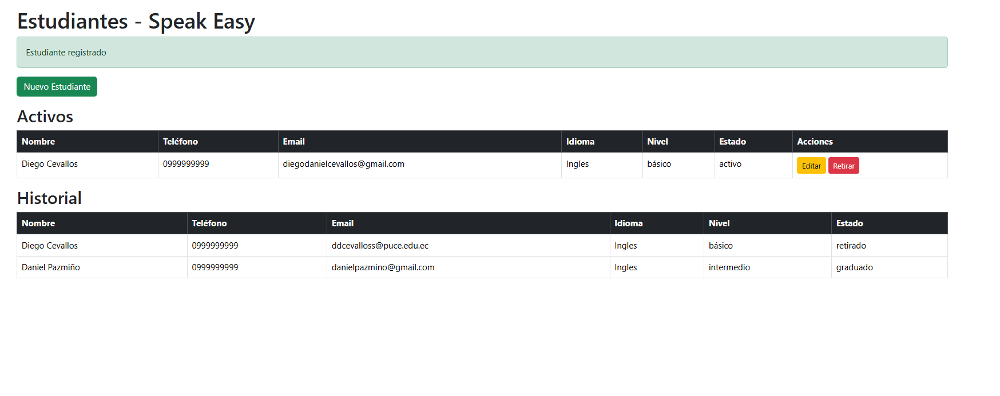
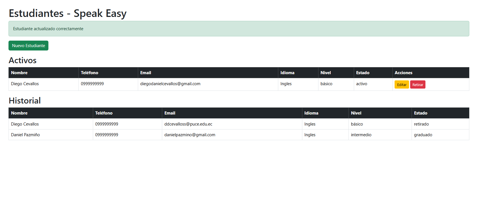
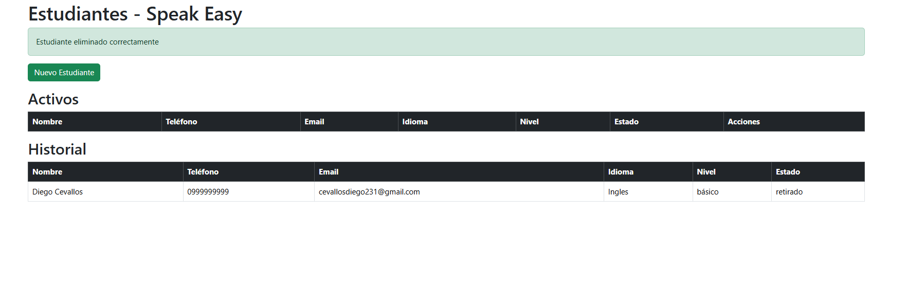

##Proyecto Examenidiomas1

###Proceso realizado
Se creó la migración para la tabla de estudiantes, definiendo los campos necesarios como nombre, teléfono, correo electrónico, idioma, nivel y estado.

Se generó el modelo Estudiante, configurado para permitir el manejo de los atributos principales y facilitar las operaciones con la base de datos.

Se construyó el controlador EstudianteController, con los métodos esenciales para el flujo CRUD: listar, crear, almacenar, editar, actualizar y eliminar estudiantes.

Se configuraron las rutas en el archivo principal de Laravel, utilizando la estructura de recurso para conectar automáticamente las acciones del controlador con las direcciones web correspondientes.

Se diseñó la vista principal (index), donde se muestran los estudiantes activos y el historial de los que están pausados, graduados o retirados.

Se elaboró la vista de creación (create), que contiene el formulario para registrar nuevos estudiantes en el sistema.

Se preparó la vista de edición (edit), que permite modificar los datos de un estudiante ya registrado.

Se creó un layout base, que sirve como plantilla general para todas las vistas y asegura un diseño uniforme en la aplicación.

Se configuró la validación de datos, incluyendo mensajes personalizados para evitar duplicidad en correos electrónicos y garantizar que los campos obligatorios se llenen correctamente.

Se organizó la estructura de carpetas y archivos dentro del proyecto, manteniendo la separación clara entre modelos, controladores, migraciones y vistas.

Finalmente, se inicializó el proyecto en Git, se conectó al repositorio en GitHub llamado Examenidiomas1 y se subieron los archivos siguiendo el flujo estándar de commits y push.

###EVIDENCIAS

